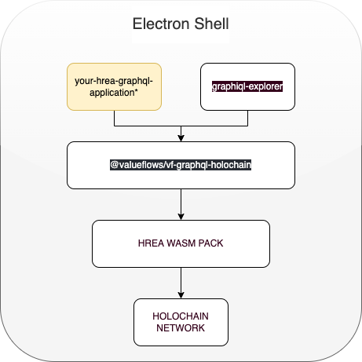

# hREA-Electron-Starter

This starter kit allows you to build your own REA holochain application without having to install, build or compile holochain code..
It runs out of the box with a sample web client. Understanding of the REA ontology is covered in other projects including a visual Launcher app (REA explorer)
["REA Guide"](https://hackmd.io/@connoropolous/B1B5qAIpK)

Later additions of this project should include a new version of the REA-graphiql-explorer.

    

[IMPORTANT! Check Dependency Versions Information (Holochain etc)](#dependency-versions-information)

__Table of Contents__
- [Set Up after Clone](#set-up-after-clone)
  - [App Icon Images](#app-icon-images)
- [Run Locally and Develop on your Computer](#run-locally-and-develop-on-your-computer)
- [Multi User Development Testing](#multi-user-development-testing)
- [Building / Packaging](#building--packaging)
- [Versioning for User Data](#versioning-for-user-data)
- [IMPORTANT! Dependency Versions Information (Holochain etc)](#dependency-versions-information)

## Set Up after Clone

Global find and replace:

`hrea-electron-starter`: replace with the actual name you wish to see appear in users desktop launcher icons

`com.some-domain-name.app-name`: replace with an Apple ["bundle Id"](https://developer.apple.com/documentation/appstoreconnectapi/bundle_ids) that is registered on your Apple Developer account

### App Icon Images

Replace `electron/build/icon.icns`. This one is utilized by MacOS.

Replace `electron/build/icon.ico`. This one is utilized by Windows

TODO: linux

## Run Locally and Develop on your Computer

_Prerequisites_

- Have nodejs version 14 or greater installed on your system

Then run

- `npm run install-deps`
- `npm run dev`

In the future, just run `npm run dev` anytime to develop.

When you run `npm run dev` a `user-data/` directory is created and this is where user data including private keys, and also data generated through use of the app is stored.

You can run `npm run user-data-reset` if you have user data in development, but you want to clear it, and start over with fresh identities.

> NOTE: if you see a blank screen once electron launches the app, refresh the page (using View -> Reload or Cmd/Ctrl-R) to see app contents.

> NOTE: occasionally shutdown will not be clean (Ctrl-C) and you will have to kill zombies like (holochain-runner and lair-keystore)

### specific to your use case:

**web** (user interface)

- the default web client is ng-rea-client.. you can run it independently and swap it out with another framework/design  
- `npm run web`

**electron**

- `npm run electron-tsc` (**needs to be re-run whenever electron folder source code changes**)
- `npm run electron` (you can run electron which bundles the HREA binaries indepently of the front end )

**ENVIRONMENTS**

- be sure to configure your prefered environment settings prior to running the happ currently located at electron/src/enviroments (this will change soon) 

**REA suite**

- The REA wasm files are installed under the REA directory and copied to the electron backend.. The REA suite is compatible with the specific holochain version 

## Multi-User Development Testing
TODO

## Building / Packaging

To build:

- `npm run build`

The packaged executables can be found in `electron/out`.

In order to get cross-platform builds, just tag your repository like `v0.0.1` and push those tags to Github. CI will automatically start running a build, under the "Release" action.

> Macos: You will need to have set the following environment variables as repository secrets:
> - APPLE_CERTIFICATE_BASE64
> - APPLE_CERTIFICATE_PASS
> - APPLE_DEV_IDENTITY
> - APPLE_ID_EMAIL
> - APPLE_ID_PASSWORD
> 
> The first two should be set as equivalents of `MACOS_CERTIFICATE` = `APPLE_CERTIFICATE_BASE64` and `MACOS_CERTIFICATE_PWD` = `APPLE_CERTIFICATE_PASS` as found in the following article, which also provides other instruction regarding this: https://localazy.com/blog/how-to-automatically-sign-macos-apps-using-github-actions
>
> There is a sixth environment variable which is useful to set, like this: `DEBUG: electron-osx-sign*,electron-notarize*`. This allows for useful logging outputs from the signing and notarizing process. This env var is set automatically when running on CI, in the "Release" Github Action.

## Versioning For User Data

Each version of the app will either change, or not change, the paths to the user data folders in use by the application. 

The user data will be located under a folder with the same name as the value given under the [`name` property of the file `electron/package.json`](./electron/package.json#L2) in the platform specific appData folder, as specified by `appData` here: https://www.electronjs.org/docs/latest/api/app#appgetpathname

It is then in a specific sub-folder that relates to one of two types of data: 
- source chain and DHT -> `databases-${DATABASES_VERSION_ID}`
- private keys -> `keystore-${KEYSTORE_VERSION_ID}`

DATABASES_VERSION_ID and KEYSTORE_VERSION_ID are defined in `electron/src/holochain.ts` and can be modified as needed in order to jump to new versions of holochain, or a new app DNA.

You can tweak DATABASES_VERSION_ID and KEYSTORE_VERSION_ID independently. 

DATABASES_VERSION_ID should be incremented when a new DNA is in use. It will cause users to have to re-create profiles and re-instate data they've previously added.

KEYSTORE_VERSION_ID should be incremented if the version of lair-keystore changes, and has a new key format. Or if you otherwise want users to have to switch and generate new keys.

## Dependency Versions Information

This project is currently using:

https://github.com/holochain/holochain/releases/tag/holochain-0.0.126

https://github.com/Sprillow/holochain-runner/releases/tag/v0.0.35

Lair Keystore Revision [v0.0.9 Nov 4, 2021](https://github.com/holochain/lair/releases/tag/v0.0.9)

https://docs.rs/hdk/0.0.122/hdk/index.html

hREA wasm suite version 0.0.1-alpha.4
https://github.com/h-REA/hREA/releases/tag/0.0.1-alpha.4  

and electron 16

https://www.electronjs.org/docs/latest/api/app

